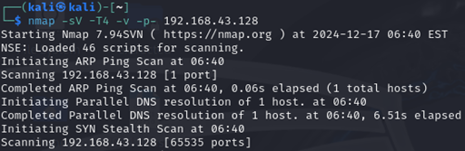

## Prosjektpresentasjon

**Kort fortalt:** Jeg analyserte en sårbar *vsftpd 2.3.4*-tjeneste i et lukket labmiljø, demonstrerte utnyttelse med Metasploit, og verifiserte kontroll ved å opprette og bruke en egen lab-bruker.

### Mål
- Bekrefte sårbar FTP-versjon
- Demonstrere utnyttelse (shell)
- Verifisere vedvarende, legitim tilgang i lab (ny bruker + innlogging)

### Miljø
- Angriper: Kali Linux  
- Mål: Metasploitable 2 (lokalt labnett)  
- Verktøy: Nmap, Metasploit

### Fremgangsmåte (høydenivå)
**1) Tjenestekartlegging (FTP & versjon)**  
Jeg identifiserte at port 21 kjørte *vsftpd 2.3.4*, en historisk kompromittert versjon med bakdør.  
  
*(Større utsnitt av skanningen:)*  

**2) Valg av riktig exploit**  
I Metasploit startet jeg konsollen og valgte modulen for den kjente vsftpd-bakdøren.  
  

**3) Utnyttelse og bekreftelse av shell**  
Utnyttelsen ga interaktivt shell (verifisert med `whoami`/`id`).  

**4) Vedvarende lab-tilgang (valgfritt bevis)**  
Jeg opprettet en vanlig lab-bruker og satte passord for å vise legitim innlogging i etterkant.  

**5) Verifikasjon**  
Innlogging med den nye brukeren fungerte som forventet.  

### Læringspoeng
- **Oppdagelse → utnyttelse → verifikasjon:** en ren, pedagogisk kjede fra sårbar tjeneste til kontroll.  
- **Bakdører i “legacy”-tjenester:** små versjonsdetaljer kan gi full systemtilgang.  
- **Etikk og hygiene:** alt gjennomført i lab; maskér sensitive detaljer før publisering.

### Defensive notater (kort)
- Fjern/oppgrader *vsftpd 2.3.4* og steng ubrukte porter.  
- Overvåk uvanlig aktivitet (f.eks. uventet trafikk på port 6200/tcp).  
- Etabler patch-rutiner og integritetssjekk av binærer.
